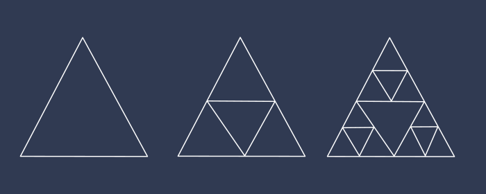

Si eres un amante de los fractales, la geometría analítica y la programación, en este articulo aprenderás a dibujar fractales utilizando Java Script.

Los fractales son figuras geométricas formadas por repeticiones de un mismo patron un gran número de veces. Un fractal nos da una representación gráfica de lo comúnmente conocido en la programación como **recursividad**. En este post programaremos algunos de los fractales más famosos.

## Funciones auxiliares
Antes de entrar en materia les muestro algunas funciones y librerías complementarias que se utilizaron para simplificar los algoritmos.

1. Se empleo la librería externa [Victor](http://victorjs.org/) que posee un conjunto de funciones necesarias a la hora de trabajar con vectores.
2. Se creó la clase ```quque``` la cual consta de una implementación muy básica de lo que seria una **cola**.
```Java Script
   export const queue = function() {
    this.q = []

    this.push = function(ele) {
        this.q.push(ele)
    }

    this.empty = function() {
        return this.q.length === 0
    }

    this.top = function() {
        if(!this.empty())
            return this.q[0]
        return null
    }

    this.pop = function() {
        if(!this.empty())
            return this.q.shift()
        return null
    }
}
```
3. Se creó un archivo ```paint.js``` el cual contiene un conjunto de métodos para simplificar el proceso a la hora de "dibujar" sobre el ```canvas``` de ```html```
```Java Script
export const resetCanvas = (ctx, width, height) => {
    ctx.fillStyle = '#071a52'
    ctx.fillRect(0, 0, width, height)
    ctx.strokeStyle = "#f0f0f0"
}

export const drawLineVector = (ctx, v) => {

    for(let i = 0; i < v.length - 1; i++){
        ctx.beginPath()
        ctx.moveTo(v[i].x, v[i].y)
        ctx.lineTo(v[i+1].x, v[i+1].y)
        ctx.stroke()
        ctx.closePath()
    }
}

export const drawLine2Point = (ctx, p1, p2) => {
    ctx.beginPath()
    ctx.moveTo(p1.x, p1.y)
    ctx.lineTo(p2.x, p2.y)
    ctx.stroke()
    ctx.closePath()
}
```

## Triángulo de Sierpinski



Como se muestra en la figura el fractal se logra repitiendo el mismo triangulo con dimensiones mas reducidas.

La siguiente figura nos ayudara a comprender el proceso matemático:


1. Creamos el triangulo P1P2P3
2. Calculamos los puntos medios P1', P2' y P3'
3. Creamos los triángulos P1P1'P3', P1'P2P2'y P2'P3P3'
4. Repetimos el proceso con los nuevos triángulos creados.

A continuación el código:

Importamos las dependencias necesarias.
```Java Script
import Victor from 'victor'
import {drawLine2Point} from './paint'
```

Creamos una clase  ```Triangle```
```Java Script
const Triangle = function(p1, p2, p3, tag) {
    this.p1 = p1
    this.p2 = p2
    this.p3 = p3
    this.tag = tag
    this.generated = false

    this.show = function(ctx){
        if(this.tag === 'root'){
            drawLine2Point(ctx, this.p1, this.p2)
            drawLine2Point(ctx, this.p2, this.p3)
            drawLine2Point(ctx, this.p3, this.p1)
        }else if(this.tag === 't1'){
            drawLine2Point(ctx, this.p2, this.p3)
        }else if(this.tag === 't2'){
            drawLine2Point(ctx, this.p3, this.p1)
        }else if(this.tag === 't3'){
            drawLine2Point(ctx, this.p1, this.p2)
        }
    }

    this.T1 = function() {
        let t1_p1 = new Victor(this.p1.x, this.p1.y)
        let t1_p2 = new Victor((this.p1.x + this.p2.x) / 2, (this.p1.y + this.p2.y) / 2)
        let t1_p3 = new Victor((this.p1.x + this.p3.x) / 2, (this.p1.y + this.p3.y) / 2)
        let t1 = new Triangle(t1_p1, t1_p2, t1_p3, 't1')
        return t1
    }

    this.T2 = function() {
        let t2_p1 = new Victor((this.p1.x + this.p2.x) / 2, (this.p1.y + this.p2.y) / 2)
        let t2_p2 = new Victor(this.p2.x, this.p2.y)
        let t2_p3 = new Victor((this.p2.x + this.p3.x) / 2, (this.p2.y + this.p3.y) / 2)
        let t2 = new Triangle(t2_p1, t2_p2, t2_p3, 't2')
        return t2
    }

    this.T3 = function() {
        let t3_p1 = new Victor((this.p1.x + this.p3.x) / 2, (this.p1.y + this.p3.y) / 2)
        let t3_p2 = new Victor((this.p2.x + this.p3.x) / 2, (this.p2.y + this.p3.y) / 2)
        let t3_p3 = new Victor(this.p3.x, this.p3.y)
        let t3 = new Triangle(t3_p1, t3_p2, t3_p3, 't3')
        return t3
    }
}
```

Por último creamos la función que genera el fractal:
```Java Script
export const Sierpinski = (ctx, p1, p2, p3, n) => {
    let T = []
    let root = new Triangle(p1, p2, p3, 'root')
    T[0] = root

    while(n--){
        for(let i = T.length - 1; i >= 0; i--){
            if(!T[i].generated){
                T.push(T[i].T1())
                T.push(T[i].T2())
                T.push(T[i].T3())
                T[i].generated = true
            }
        }
    }

    for(let i = 0; i < T.length; i++){
        T[i].show(ctx)
    }
}
```

Esta función recibe 5 parámetros:
1. ```ctx``` Referencia al contexto del objeto canvas (```canvas.getContext('2d')```)
2. ```p1``` Objeto de tipo ```Victor``` que contiene las cordenadas del punto p1.
3. ```p2``` Objeto de tipo ```Victor``` que contiene las cordenadas del punto p2.
4. ```p3``` Objeto de tipo ```Victor``` que contiene las cordenadas del punto p3. 
5. ```n``` Entero que representa el número de niveles.

Asi quedara nuestro fractal:


## Curva Dragón

Este fractal se construye siguiendo los siguientes pasos:

1. Dado un segmento AB se construye un triángulo isósceles y rectángulo con base AB
2. Se borra el segmento AB.
3. Se repite el procedimiento un número determinado de veces.

La siguiente imagen muestra el proceso para los primeros 3 niveles.


A continuación el código:

Importamos las dependencias necesarias:

```Java Script
import Victor from 'victor'
import {queue} from './queue'
import {drawLine2Point} from './paint'
```

Creamos una función auxiliar que retorna el punto entre A y B que forma un triángulo isósceles y rectángulo:

```Java Script
const mP = (p1, p2) => {

    return new Victor(
        (p1.x + p2.x + p1.y - p2.y) / 2, 
        (p2.x - p1.x + p1.y + p2.y) / 2)
}
```

Creamos la función que genera el fractal mediante un algoritmo BFS.

```Java Script
let Q = new queue();

export const dragon_bfs = (ctx, a, b, n) => {
    let line = {
        p1: a,
        p2: b
    }

    if(!n){
        drawLine2Point(ctx, line.p1, line.p2)
    }else{
        Q.push(line)
        let N = Math.pow(2, n) - 1

        while(N){
            let l = Q.top()
            Q.pop()

            let l1 = {
                p1: l.p1,
                p2: mP(l.p1, l.p2)
            } 
        
            let l2 = {
                p1: l.p2,
                p2: mP(l.p1, l.p2)
            }
            Q.push(l1)
            Q.push(l2)
            N--
        }
        N = Math.pow(2, n)

        while(N){
            drawLine2Point(ctx, Q.top().p1, Q.top().p2)
            Q.pop()
            N--
        }
    }
}
```

Esta funcion recibe 4 parámetros:
1. ```ctx``` Referencia al contexto del objeto canvas (```canvas.getContext('2d')```)
2. ```a``` Objeto de tipo ```Victor``` que contiene las cordenadas del punto a.
3. ```b``` Objeto de tipo ```Victor``` que contiene las cordenadas del punto b. 
4. ```n``` Entero que representa el número de niveles.

Asi quedara nuestro fractal:


## Curva de Von Kock

Descubierta por el matemático Helge Von Koch en 1904. La curva se construye de la siguiente manera:

1. Dado un segmento AB se divide en tres partes iguales (3 segmentos).
2. Con el segmento del medio construimos un triangulo equilátero.
3. Se repite el proceso para cada uno de los segmentos mas pequeños.

Veamos el proceso en la siguiente figura:


Veamos para los dos primeros niveles:


A continuación el código:

Importamos las dependencias

```Java Script
import {drawLineVector} from './paint'
```

Crearemos dos funciones auxiliares. 

La primera para determinar los puntos a 1/3 y 2/3 del segmento AB.

```Java Script
const getPoint = (a, b, t) => {
    return {
        x: a.x * (1 - t) + b.x * t,
        y: a.y * (1 - t) + b.y * t 
    }
}
```

Esta función recibe 3 parámetros: los puntos a y b del segmento a particionar y una proporción t, de tal manera cuando ```t=1/3``` retorna el punto a ```1/3``` del segmento y cuando ```t=2/3``` retorna el punto a 2/3 del segmento. 

La segunda función recibe tres parámetros: un punto ```p```, un punto ```c``` y un diferencial de angulo ```da``` (en radianes). Lo que hace es rotar el punto ```p``` ```da``` radianes sobre la circunferencia con centro en ```c```  y radio igual a la distancia entre el punto ```p``` y el punto ```c```.

```Java Script
const getCirPoint = (p, c, da) => {
    let dx = p.x - c.x
    let dy = p.y - c.y
    let r = Math.sqrt(dx*dx + dy*dy)
    let a = Math.atan2(dy, dx)
    a -= da

    let q = {
        x: c.x + r * Math.cos(a),
        y: c.y + r * Math.sin(a)
    }

    return q
}
```

Finalmente la función que genera la curva:

```Java Script
const pi = Math.PI

export const vonKock = (ctx, a, b, n) => {
    let P = [a, a, a, a, b]
    
    P[1] = getPoint(P[0], P[4], 1.0/3.0)
    P[3] = getPoint(P[0], P[4], 2.0/ 3.0)
    P[2] = getCirPoint(P[3], P[1], pi / 3.0)
        
    if(n <= 1){
        drawLineVector(ctx, P, true)
    }else{
        for(let i = 0; i < P.length - 1; i++)
            vonKock(ctx, P[i], P[i + 1], n-1)
    }
}
```

Esta función recibe 4 parámetros:
1. ```ctx``` Referencia al contexto del objeto canvas (```canvas.getContext('2d')```)
2. ```a``` Objeto de tipo ```Victor``` que contiene las cordenadas del punto a.
3. ```b``` Objeto de tipo ```Victor``` que contiene las cordenadas del punto b. 
4. ```n``` Entero que representa el número de niveles.

A continuación otra implementación que arroja el mismo resultado:

```Java Script
const pi = Math.PI
export const vonKock = (ctx, a, b, n) => {
    let P = [a, a, a, a, b]

    P[1] = {
        x: a.x + (b.x - a.x) / 3,
        y: a.y + (b.y - a.y) / 3
    }

    P[3] = {
        x: b.x + (a.x - b.x) / 3,
        y: b.y + (a.y - b.y) / 3
    }

    P[2] = {
        x: (P[1].x + P[3].x) * Math.cos(pi/3) + (P[3].y - P[1].y)*Math.sin(pi/3),
        y: (P[1].y + P[3].y) * Math.cos(pi/3) - (P[3].x - P[1].x)*Math.sin(pi/3)
    }

    if(n <= 1){
        drawLineVector(ctx, P)
    }else{
        for(let i = 0; i < P.length - 1; i++)
            vonKock(ctx, P[i], P[i + 1], n-1)
    }
}
```

Asi quedara nuestro fractal:


## Dibujando arboles

Ahora crearemos fractales con forma de arboles.

Para crear este tipo de fractales procedemos de la siguiente forma.
 1. Dado un segmento AB se crean dos copias con menor tamaño.
 2. Se rotan los nuevos segmentos con un determinado angulo.
 3. Se trasladan los dos segmentos hasta coincidir con el punto B.
 4. Se repite el proceso para cada segmento.

En la siguiente figura se muestra el proceso mencionado.


Variando el nuevo tamaño y canda angulo de rotación se pueden crear infinidad de arboles distintos.

Veamos el código:

Importamos las dependencias necesarias
```Java Script
import Victor from 'victor'
import {drawLine2Point} from './paint'
```

Creamos una clase  ```Branch``` la cual sera una representación de una rama del árbol y presenta las siguientes propiedades:
 1. ```start``` Objeto de tipo ```Victor``` que representa el punto donde comienza la rama.
 2. ```end``` Objeto de tipo ```Victor``` que representa el punto donde termina la rama.
 3. ```al``` Angulo de rotación (en radianes) de la rama izquierda (hija).
 4. ```ar``` Angulo de rotación (en radianes) de la rama derecha (hija). 
 5. ```divl``` Factor de crecimiento de la rama izquierda (hija),
 6. ```divr``` Factor de crecimiento de la rama derecha (hija).

```Java Script
const Branch = function(start, end, al, ar, divl, divr) {
    this.start = start
    this.end = end
    this.left_angle = al
    this.right_angle = ar
    this.divl = divl
    this.divr = divr
    this.completed = false

    this.show = function(ctx) {
        drawLine2Point(ctx, this.start, this.end)
    }

    this.branchA = function() {
        let dir = new Victor(this.end.x, this.end.y).subtract(this.start) 
        dir.rotate(this.right_angle)
        dir.divide(new Victor(this.divr, this.divr))
        dir.add(this.end)

        let right = new Branch(this.end, dir, this.left_angle, this.right_angle, this.divl, this.divr)
        return right
    }

    this.branchB = function() {
        let dir = new Victor(this.end.x, this.end.y).subtract(this.start) 
        dir.rotate(this.left_angle)
        dir.divide(new Victor(this.divl, this.divl))
        dir.add(this.end)
        
        let left = new Branch(this.end, dir, this.left_angle, this.right_angle, this.divl, this.divr)
        return left
    }
}
```

Por ultimo el código que genera el árbol:
```Java Script
export const generateTree = (ctx, p1, p2, al, ar, divl, divr, n) => {
    let T = []
    let root = new Branch(p1, p2, al, ar, divl, divr)
    T[0] = root    

    while(n--){
        for(let i = T.length - 1; i >= 0; i--){
            if(!T[i].completed){
                T.push(T[i].branchA())
                T.push(T[i].branchB())
            }
            T[i].completed = true
        }
    }

    for(let i = 0; i< T.length; i++){
        T[i].show(ctx)
    }
}
``` 

Esta función recibe 8 parámetros:
1. ```ctx``` Referencia al contexto del objeto canvas (```canvas.getContext('2d')```)
2. ```p1``` Objeto de tipo ```Victor``` que contiene las cordenadas del punto de inicio del tronco.
3. ```p2``` Objeto de tipo ```Victor``` que contiene las cordenadas del punto donde termina el tronco.
4. ```al``` Angulo de rotación (en radianes) de las ramas izquierdas.
5. ```ar``` Angulo de rotación (en radianes) de las ramas derechas. 
6. ```divl``` Factor de crecimiento de las ramas izquierdas.
7. ```divr``` Factor de crecimiento de la ramas derechas.
8. ```n``` Entero que representa el número de niveles.

Cabe resaltar que el factor de crecimiento debe de estar en el rango de 0 a 1 para que todo tenga sentido.

Asi quedara nuestro fractal:


## L-System

Por ultimo les comentare de un algoritmo que generaliza todo lo que hemos visto hasta este momento ya que con el se puede obtener cualquier fractal posible. El algoritmo encuentra gran aplicación a la hora de generar los mapas de los videojuegos (tanto arboles como terrenos).

Un sistema L-System consiste de un alfabeto con el cual se generan cadenas de caracteres siguiendo determinadas reglas y comenzando por un ```string``` inicial denominado ```axion``` Veamos un ejemplo:

```Java Script
axion = "A"
rule1 = {key:"A", value:"AB"} //A =>> AB
rule2 = {key:"B", value:"C"} //B ==> C

//Esto genera
//1. A
//2. AB
//3. ABA
//4. ABAAB
//5. ABAABABA
//.......
```

Visto esto se puede construir un pequeño interprete si definimos algunas reglas, por ejemplo:

Si nuestra cadena solo contiene los caracteres ```F [ ] + -```, se puede definir que:
1. ```F``` Dibuja una linea vertical
2. ```[``` Guarda en una pila la referencia del ultimo punto del segmento dibujado.
3. ```]``` Sacar de la pila el punto.
4. ```+``` Rotar ```n``` grados en sentido horario el segmento a dibujar.
5. ```-``` Rotar ```n``` grados en sentido anti-horario el segmento a dibujar.   

Con esto definido lo único que tenemos que hacer es seleccionar correctamente el ```axion``` las reglas y los ángulos para generar cualquier figura deseada.

Para la programación crearemos 3 funciones, una que genere el patron, otra que interprete el patron generado y la función que dibuje la figura.

Primero importamos las dependencias.
```Java Script
import Victor from 'victor'
import {drawLine2Point} from './paint'
```

Función que genera el patron:

```Java Script
const create_patron = (sentence, rules) => {
    let nextSentece = ''
    for(let i = 0; i < sentence.length; i++){
        let current = sentence.charAt(i)
        let found = false
        for(let r = 0; r < rules.length; r++){
            if(current === rules[r].a){
                found = true
                nextSentece += rules[r].b
                break
            }
        } 
        if(!found)
            nextSentece += current
    }

    return nextSentece
}
```

Función interprete
```Java Script
const interprete = (ctx, sentence, a, b, angle) => {
    let stack = []
    
    let l = {
        p1: a,
        p2: b
    }

    
    for(let i = 0; i < sentence.length; i++){
        let current = sentence.charAt(i)

        if(current === 'F'){
            drawLine2Point(ctx, l.p1, l.p2)
            let newp1 = l.p2
            let newp2 = new Victor(l.p2.x, l.p2.y).subtract(l.p1)
            newp2.add(l.p2)
            
            l = {
                p1: newp1,
                p2: newp2
            }
        }else if(current === '+'){
            let newp1 = l.p1
            let newp2 = new Victor(l.p2.x, l.p2.y).subtract(l.p1)
            newp2.rotate(angle)
            newp2.add(newp1)
            l = {
                p1: newp1,
                p2: newp2
            }
        }else if(current === '-'){
            let newp1 = l.p1
            let newp2 = new Victor(l.p2.x, l.p2.y).subtract(l.p1)
            newp2.rotate(-angle)
            newp2.add(newp1)
            l = {
                p1: newp1,
                p2: newp2
            }
        }else if(current === '['){
            stack.push(l)
        }else if(current === ']'){
            l = stack.pop()
        }
    }
}
```

Por ultimo la función que dibuja el fractal:
```Java Script
export const Lsystem = (ctx, axion, rules, a, b, angle, factor_scale, n) => {
    let sentence = axion
    let scale = 1
    while(n--){
        sentence = create_patron(sentence, rules)
        scale *= factor_scale
    }
    
    let dir = new Victor(b.x, b.y).subtract(a) 
    dir.divide(new Victor(scale, scale))
    dir.add(a)
    interprete(ctx, sentence, a, dir, angle)
}
```

Esta función recibe 8 parámetros:
1. ```ctx``` Referencia al contexto del objeto canvas (```canvas.getContext('2d')```)
2. ```axion``` ```string``` que representa el axiom.
3. ```rules``` Arreglo que contiene todas las reglas definidas. 
4. ```a``` Objeto de tipo ```Victor``` que indica el inicio del segmento.
5. ```b``` Objeto de tipo ```Victor``` que indica el final del segmento.
6. ```angle``` Angulo en radianes que indica la rotación del segmento.
7. ```factor_scale``` Valor que permite ajustar el dibujo a medida que crecen los niveles.
8. ```n``` Entero que representa el número de niveles.

A continuación algunos ejemplos:

### Tree


### Hibiscus a 30 grados


### Hilbert curve 


### Triangle of Sierpinski


